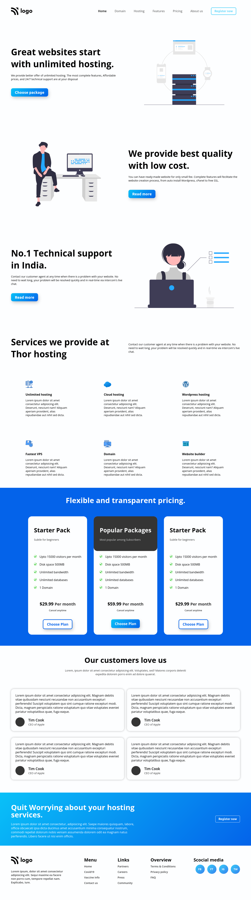

# This is a landing page for hosting website

Made by **Aditya Kadali**

## Screenshots:

## Built with:

- Semantic HTML5 tags
- Custom CSS Classes
- Flexbox
- Grid layout

## Key Learnings:

- In this project I learned to made multi section landing page.
- I learned to place cards using grid system efficiently.
- Used box shadows in cool looking way.

## Time taken:

- This project took me 5hrs to build from scratch

## Links:

- [Live Demo](https://hosting-homepage.netlify.app/)
- [Source Code](https://github.com/Adityakadali/Hosting-landingpage)
# template-hosting
# template-hosting
# template-hosting
